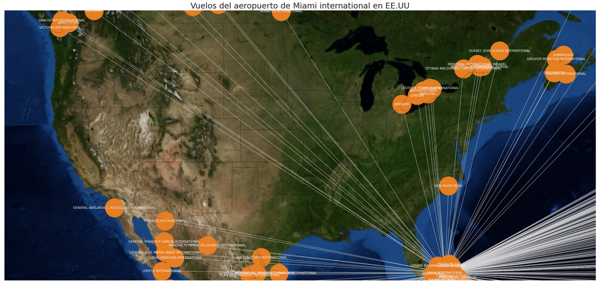

# Curso de Visualización de la Información IIMAS-UNAM 
Repositorio de notas, practicas, tareas y proyectos del curso de Visualización de la Información, impartido en la [Licenciatura en Ciencia de Datos](https://cienciadatos.iimas.unam.mx/) en el [IIMAS](https://www.iimas.unam.mx/).

## [Prácticas y tareas](Practicas/)
  - [Práctica 1](https://nbviewer.org/github/gandres-dev/Visualizacion-Informacion/tree/main/practicas/01-practica/PracticaT1.ipynb)
    - [Tarea - Informe de enfermedades del corazón](https://nbviewer.org/github/gandres-dev/Visualizacion-Informacion/tree/main/tareas/01-Tarea/notebook/01-Tarea-VI.ipynb)
  - [Práctica 2](https://nbviewer.org/github/gandres-dev/Visualizacion-Informacion/tree/main/practicas/02-practica)
    - [Tarea - Ilusiones opticas](https://nbviewer.org/github/gandres-dev/Visualizacion-Informacion/tree/main/tareas/02-Tarea/)
  - [Práctica 3](https://nbviewer.org/github/gandres-dev/Visualizacion-Informacion/tree/main/practicas/03-practica/Practica3.ipynb)
    - [Tarea - Visualizando la transformada rápida de Fourier](https://nbviewer.org/github/gandres-dev/Visualizacion-Informacion/tree/main/tareas/02-Tarea/notebook/Tarea3-VI.ipynb)
  - [Práctica 4](https://github/gandres-dev/Visualizacion-Informacion/tree/main/practicas/04-practica)
    - [Tarea - Epidemia de Ébola](https://nbviewer.org/github/gandres-dev/Visualizacion-Informacion/tree/main/tareas/04-Tarea/notebook/Tarea4_VI.ipynb)
  - [Práctica 5](https://nbviewer.org/github/gandres-dev/Visualizacion-Informacion/tree/main/practicas/05-practica/Practica5-PCA.ipynb)
    - [Tarea - Distancias Manhattan, Minkowski y Euclideana](https://nbviewer.org/github/gandres-dev/Visualizacion-Informacion/tree/main/tareas/05-Tarea/notebook/Tarea5_VI.ipynb)
  - [Práctica 6](https://nbviewer.org/github/gandres-dev/Visualizacion-Informacion/tree/main/practicas/06-practica/practica6.ipynb)
    - [Tarea - Importancia del esquema de colores](https://nbviewer.org/github/gandres-dev/Visualizacion-Informacion/tree/main/tareas/06-Tarea)    
  - [Práctica 7](https://nbviewer.org/github/gandres-dev/Visualizacion-Informacion/tree/main/practicas/07-practica/practica7.ipynb)
    - [Tarea - Paletas de color](https://nbviewer.org/github/gandres-dev/Visualizacion-Informacion/tree/main/tareas/07-Tarea/notebook/Tarea7_VI.ipynb)
  - [Práctica 8](https://nbviewer.org/github/gandres-dev/Visualizacion-Informacion/tree/main/practicas/08-practica/Practica8_VI.ipynb)
    - [Tarea - Análisis del calentamiento global](https://nbviewer.org/github/gandres-dev/Visualizacion-Informacion/tree/main/tareas/08-Tarea/Tarea8_VI.ipynb)
  - [Práctica 9](https://nbviewer.org/github/gandres-dev/Visualizacion-Informacion/tree/main/practicas/09-practica/master)
    - [Tarea - Base de Datos Global de Plantas de Energía](https://nbviewer.org/github/gandres-dev/Visualizacion-Informacion/tree/main/tareas/09-Tarea/notebook/Tarea9_VI.ipynb)
  - [Práctica 10]()
    - [Tarea - Qlik](https://nbviewer.org/github/gandres-dev/Visualizacion-Informacion/tree/main/tareas/10-Tarea/)
  - [Práctica 11](https://nbviewer.org/github/gandres-dev/Visualizacion-Informacion/tree/main/practicas/11-practica/Practica11.ipynb)
    - [Tarea - Venta de Casas en Ames-Iowa Qlik](https://nbviewer.org/github/gandres-dev/Visualizacion-Informacion/tree/main/tareas/11-Tarea/)
  - [Práctica 12](https://nbviewer.org/github/gandres-dev/Visualizacion-Informacion/tree/main/practicas/12-practica/Practica12.ipynb)
    - [Tarea - Pronóstico de series de tiempo](https://nbviewer.org/github/gandres-dev/Visualizacion-Informacion/tree/main/tareas/12-Tarea/notebook/Tarea12_VI.ipynb)    
  - [Práctica 13](https://nbviewer.org/github/gandres-dev/Visualizacion-Informacion/tree/main/practicas/13-practica/DataVIz_Practica13.ipynb)
    - [Tarea - Progreso de la vacunación contra el Covid 19](https://nbviewer.org/github/gandres-dev/Visualizacion-Informacion/tree/main/tareas/12-Tarea/notebook/Tarea13_VI.ipynb)
  - [Práctica 14](https://nbviewer.org/github/gandres-dev/Visualizacion-Informacion/tree/main/practicas/14-practica)
    - [Tarea - Representación de volumen](https://nbviewer.org/github/gandres-dev/Visualizacion-Informacion/tree/main/tareas/14-Tarea/)
  - [Práctica 15](https://nbviewer.org/github/gandres-dev/Visualizacion-Informacion/tree/main/practicas/15-practica/Practica-15.ipynb)    

<!-- -  -->

---
## [Proyecto 1 Análisis de Europuertos](https://nbviewer.org/github/gandres-dev/Visualizacion-Informacion/tree/main/proyectos/proyecto1/notebook.ipynb)

El Departamento de Transporte de los Estados Unidos abreviado como USDOT recibe informes de tráfico de
las aerolı́neas estadounidenses e internacionales que operan desde y hacia los aeropuertos estadounidenses. Cubren
los años 1990 a 2020 (US Air Traffic 1990-2020).
Deseamos a conocer a partir de este conjunto información acerca de los vuelos locales y extranjeros, ver el
comportamiento de las aerolineas a traves del tiempo, conocer las aerolineas con más vuelos, ver el progreso en los
años en cada aerolinea y ver el flujo de vuelos de las aerolineas.

## [Proyecto 2 Análisis del turismo en tiempos de Covid-19](https://nbviewer.org/github/gandres-dev/Visualizacion-Informacion/tree/main/proyectos/proyecto2/notebook.ipynb)

Base datos de Covid: https://www.gob.mx/salud/documentos/datos-abiertos-152127

El conjunto utilizado para nuestro análisis será acerca del covid-19 en México proporcionado en el sitio web datos
abiertos, y aparte utilizaremos datos proporcionados por el INEGI respecto al turismo. Con ello se desea conocer la
relación y afectación que tuvo el Covid-19 al compararlo con el turismo. Nuestra hipótesis es que la pandemia y el
encierro afectaron al turismo de forma que la cantidad de personas que emigraban e inmigraban del paı́s disminuyó
de forma considerable.

## Profesor
**Dr. Edgar Garduño**

---
## Recursos electrónicos
1. https://datavizproject.com/
1. https://www.data-to-viz.com/
1. https://python-graph-gallery.com/
1. https://d3-graph-gallery.com/
1. https://altair-viz.github.io/gallery/index.html
---
## Bibliografía básica:
1. Fundamentals of Data Visualization A Primer on Making Informative and Compelling Figures by Claus O. Wilke.
